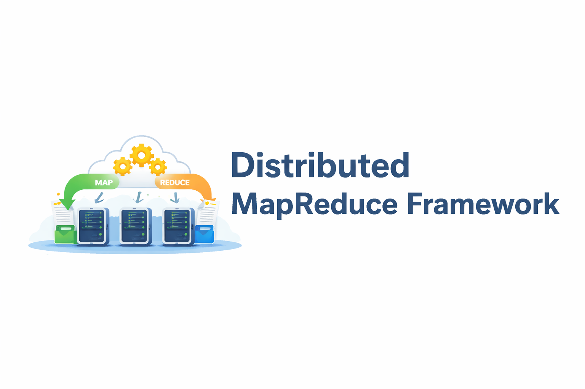
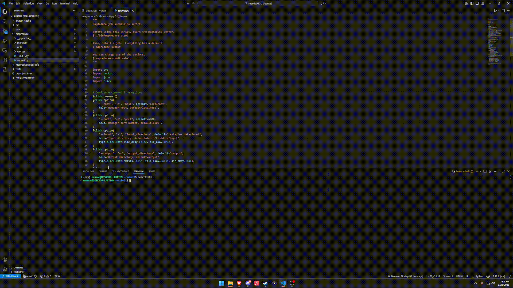

# 📦 MapReduceX

<!-- PROJECT BANNER -->

  

  <b>A fault-tolerant, distributed MapReduce framework built from scratch.</b> 
  Designed for scalability, clarity, and real-world distributed systems learning.

  
  
  
  

---

## 📌 Overview

MapReduceX is a distributed data processing framework inspired by Google’s original MapReduce paper. It enables users to execute large-scale data transformations across multiple worker nodes with built-in fault tolerance, dynamic task scheduling, and parallel execution.

This project exists to make the internals of distributed systems transparent and understandable rather than hidden behind complex abstractions.

Who this is for:
- Computer science students learning distributed systems
- Engineers curious about how MapReduce works under the hood
- Anyone seeking a clean, readable reference implementation

---

## 📚 Table of Contents

- [🛠 Fresh Setup (From a Clean Clone)](#-fresh-setup-from-a-clean-clone)
- [🚀 Quickstart](#-quickstart)
- [✨ Features](#-features)
- [🏗 Architecture](#-architecture)
- [💡 Usage Examples](#-usage-examples)
- [🎥 GIF Walkthroughs](#-gif-walkthroughs)
- [🧪 Tests](#-tests)
- [❓ FAQ](#-faq)
- [📦 Dependencies](#-dependencies)
- [🤝 Contributing](#-contributing)
- [🙏 Acknowledgements](#-acknowledgements)
- [📬 Further Resources](#-further-resources)
- [✅ Submission Checklist](#-submission-checklist)

---

## 🛠 Fresh Setup (From a Clean Clone)

These steps describe how to set up MapReduceX starting from a fresh clone of the repository.

### 1️⃣ Clone the Repository

    git clone https://github.com/Naumanbo/485-p4-map-reduce/tree/main
    cd 485-p4-map-reduce

---

### 2️⃣ Create a Python Virtual Environment

Creating a virtual environment ensures dependencies are isolated from your system Python.

#### macOS / Linux

    python3 -m venv venv
    source venv/bin/activate

#### Windows (PowerShell)

    python -m venv venv
    venv\Scripts\Activate.ps1

After activation, your terminal prompt should indicate the active environment.

---

### 3️⃣ Install Required Dependencies

With the virtual environment activated, install dependencies from the requirements file:

    pip install -r requirements.txt

This installs all runtime and development dependencies needed to run the framework and tests.

---

### 4️⃣ Verify Installation (Optional)

You can verify that dependencies are installed correctly by running:

    python --version
    pip list

---

### 5️⃣ Deactivate the Environment (Optional)

When finished, you can exit the virtual environment:

    deactivate

---

## 🚀 Quickstart

Once your environment is set up, you can run the system as follows.

### 1️⃣ Run the Coordinator

    python coordinator.py

---

### 2️⃣ Start Worker Nodes

Open additional terminals (with the virtual environment activated) and run:

    python worker.py

You can launch multiple workers to simulate a distributed cluster.

GIF PLACEHOLDER – Installation and Startup Walkthrough  

---

## ✨ Features

### 🔹 Distributed Task Scheduling
- Coordinator assigns map and reduce tasks dynamically
- Workers request tasks when idle
- Unfinished tasks are re-queued automatically

### 🔹 Fault Tolerance
- Worker health monitored via heartbeats
- Crashed workers are detected and replaced
- No data loss during execution

### 🔹 Parallel Execution
- Map tasks execute concurrently across workers
- Reduce phase begins only after all map tasks complete

### 🔹 Simple Developer Interface
- Users define custom map and reduce functions
- Framework manages execution, recovery, and coordination

---

## 🏗 Architecture

MapReduce follows a Coordinator–Worker architecture commonly used in distributed systems.

### Components

Coordinator:
- Tracks task states
- Assigns work to workers
- Detects worker failures and reassigns tasks

Workers:
- Execute map or reduce tasks
- Send periodic heartbeat messages
- Write intermediate results to disk

### 📐 Architecture Diagram

ARCHITECTURE DIAGRAM PLACEHOLDER  
Insert a diagram showing:
- Coordinator
- Multiple workers
- Task flow
- Intermediate and final outputs

---

## 💡 Usage Examples

### Example: Word Count

    def map(key, value):
        for word in value.split():
            emit(word, 1)

    def reduce(key, values):
        emit(key, sum(values))

Submit the job:

    python submit_job.py --input data/books --output results/wordcount

Example output:

    distributed: 124
    systems: 98
    mapreduce: 76

---

## 🎥 GIF Walkthroughs

### ▶️ Submitting a Job

Job Submission Flow  
Show:
- Starting the coordinator
- Workers connecting
- Job submission
- Tasks being assigned

---

### ▶️ Fault Tolerance Demo

Worker Failure Recovery  
Show:
- Worker process crashing
- Coordinator detecting failure
- Task reassignment to another worker

---

## 🧪 Tests

This project includes a test suite located in the tests directory.

### Running All Tests

    pytest tests/

---

### Running a Specific Test File

    pytest tests/test_coordinator.py

---

### Running Tests Verbosely

    pytest tests/ -v

---

### Notes
- Ensure no coordinator or worker processes are running before testing
- Some tests mock worker behavior for isolation

---

## ❓ FAQ

Why build this instead of using Hadoop or Spark?  
This project is designed for education and clarity. Production frameworks prioritize performance and scale, while MapReduceX prioritizes transparency and learning.

How many workers can I run?  
As many as your system supports. Each worker runs as an independent process.

Does this use real networking?  
Yes. Workers and the coordinator communicate over sockets to simulate real distributed execution.

Is this production-ready?  
No. This is an educational framework meant for learning and experimentation.

---

## 📦 Dependencies

- Python 3.10+
- socket
- threading
- multiprocessing
- json
- pytest (for testing)

Install all dependencies with:

    pip install -r requirements.txt

---

## 🤝 Contributing

Contributions are welcome and encouraged.

1. Fork the repository
2. Create a feature branch
3. Submit a pull request with a clear explanation

Please ensure code is readable and well-documented.

---

## 🙏 Acknowledgements

- Google Research – MapReduce: Simplified Data Processing on Large Clusters
- Univ
